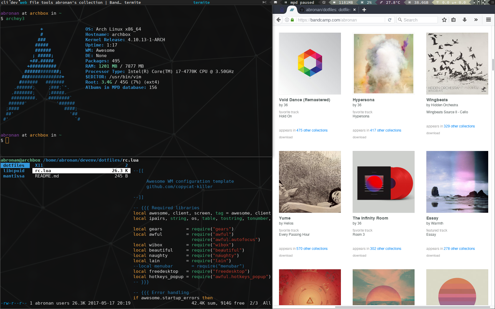

dotfiles
=================

**rc.lua** and various dotfiles for [Awesome WM](https://awesomewm.org/).

rc.lua is based on the **powerarrow** theme from
[copycat-killer](https://github.com/copycat-killer/awesome-copycats). Refer to the linked repository for installation guidelines.

Needs *termite* as well as other packages and fonts (see rc.lua).

### Required fonts

- [Hasklig](https://github.com/i-tu/Hasklig/)
- [DejaVu Sans Mono for Powerline](https://github.com/powerline/fonts)

### Screen

